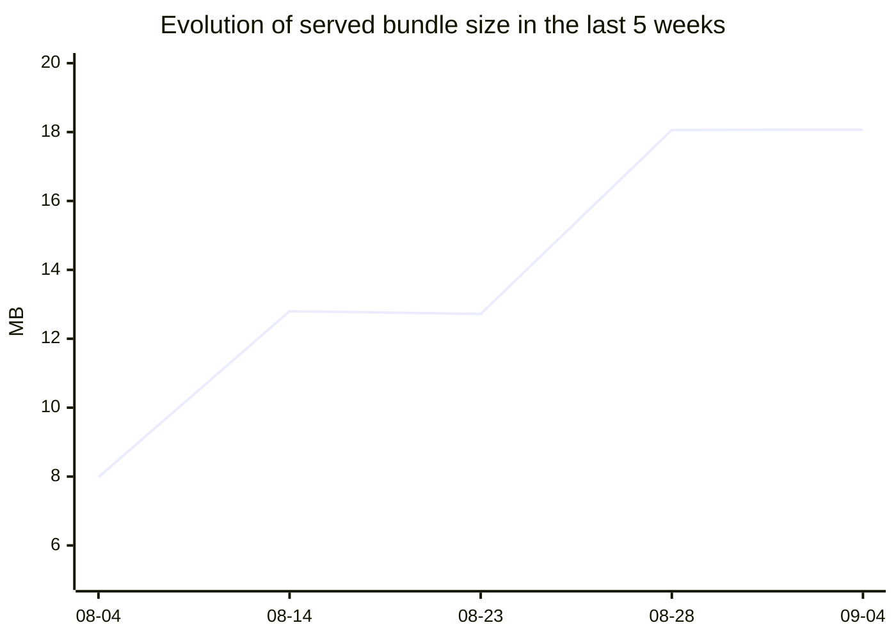

# Bundle size

_Last updated 2026-09-09 21:38 UTC._

## Trend

| Snapshot | Commit | Total brotli | Change |
| --- | --- | ---: | ---: |
| 2026-09-04 09:53 UTC | [`6afeaaa`](https://github.com/paritytech/dotli-community/commit/6afeaaa) | 18.07 MB | +11.3 KB |
| 2026-08-28 09:16 UTC | [`ffe2cc2`](https://github.com/paritytech/dotli-community/commit/ffe2cc2) | 18.06 MB | +5.34 MB |
| 2026-08-23 09:35 UTC | [`ab652eb`](https://github.com/paritytech/dotli-community/commit/ab652eb) | 12.72 MB | -78.6 KB |
| 2026-08-14 15:35 UTC | [`29ef38b`](https://github.com/paritytech/dotli-community/commit/29ef38b) | 12.80 MB | +4.83 MB |
| 2026-08-04 13:57 UTC | [`584af2d`](https://github.com/paritytech/dotli-community/commit/584af2d) | 7.98 MB |  |

_Showing 5 of 5 recorded weeks. Full history in `assets/bundle-size-history.json`._

## Latest files at `6afeaaa`

_Entry budgets: `protocol-iframe-entry` 114.7 KB / 600.0 KB, `host-entry` 157.8 KB / 600.0 KB._

| File | Raw | Brotli | Gzip | Change |
| --- | ---: | ---: | ---: | ---: |
| `host/assets/truapi_server_bg.wasm` | 7.20 MB | 5.29 MB | 5.56 MB | +2.6 KB |
| `host/assets/wasm/web/truapi_server_bg.wasm` | 7.20 MB | 5.29 MB | 5.56 MB | +2.6 KB |
| `host/assets/smoldot.js` | 3.05 MB | 2.27 MB | 2.34 MB | -165 B |
| `host/assets/smoldot_worker.js` | 3.02 MB | 2.26 MB | 2.33 MB | -616 B |
| `host/assets/paseo-people-next.smol.json` | 3.36 MB | 1.68 MB | 1.92 MB |  |
| `host/assets/paseo.smol-DboPaEh1.json` | 1.84 MB | 941.7 KB | 1.05 MB |  |
| `host/icon-512.png` | 42.8 KB | 42.8 KB | 42.8 KB |  |
| `host/assets/index.js` | 157.8 KB | 41.4 KB | 49.7 KB | -15.0 KB |
| `sandbox/assets/index.js` | 123.5 KB | 35.0 KB | 40.7 KB | +732 B |
| `host/assets/bridge.js` | 125.0 KB | 30.0 KB | 36.0 KB | +10.7 KB |
| `host/assets/src.js` | 84.2 KB | 26.5 KB | 29.6 KB | +25.6 KB |
| `host/assets/panel.js` | 76.3 KB | 20.6 KB | 23.2 KB | +49 B |
| `host/assets/wasm/web/README.md` | 13.4 KB | 13.4 KB | 13.4 KB | +1.5 KB |
| `host/assets/wasm/web/truapi_server.d.ts` | 12.6 KB | 12.6 KB | 12.6 KB | +920 B |
| `host/icon-192.png` | 12.5 KB | 12.5 KB | 12.5 KB |  |
| **host** | 26.66 MB | 18.02 MB | 19.11 MB | |
| **sandbox** | 196.1 KB | 51.2 KB | 58.9 KB | |
| **Total** | **26.85 MB** | **18.07 MB** (-33%) | **19.17 MB** | |

All files

| File | Raw | Brotli | Gzip | Change |
| --- | ---: | ---: | ---: | ---: |
| `host/assets/truapi_server_bg.wasm` | 7.20 MB | 5.29 MB | 5.56 MB | +2.6 KB |
| `host/assets/wasm/web/truapi_server_bg.wasm` | 7.20 MB | 5.29 MB | 5.56 MB | +2.6 KB |
| `host/assets/smoldot.js` | 3.05 MB | 2.27 MB | 2.34 MB | -165 B |
| `host/assets/smoldot_worker.js` | 3.02 MB | 2.26 MB | 2.33 MB | -616 B |
| `host/assets/paseo-people-next.smol.json` | 3.36 MB | 1.68 MB | 1.92 MB |  |
| `host/assets/paseo.smol-DboPaEh1.json` | 1.84 MB | 941.7 KB | 1.05 MB |  |
| `host/icon-512.png` | 42.8 KB | 42.8 KB | 42.8 KB |  |
| `host/assets/index.js` | 157.8 KB | 41.4 KB | 49.7 KB | -15.0 KB |
| `sandbox/assets/index.js` | 123.5 KB | 35.0 KB | 40.7 KB | +732 B |
| `host/assets/bridge.js` | 125.0 KB | 30.0 KB | 36.0 KB | +10.7 KB |
| `host/assets/src.js` | 84.2 KB | 26.5 KB | 29.6 KB | +25.6 KB |
| `host/assets/panel.js` | 76.3 KB | 20.6 KB | 23.2 KB | +49 B |
| `host/assets/wasm/web/README.md` | 13.4 KB | 13.4 KB | 13.4 KB | +1.5 KB |
| `host/assets/wasm/web/truapi_server.d.ts` | 12.6 KB | 12.6 KB | 12.6 KB | +920 B |
| `host/icon-192.png` | 12.5 KB | 12.5 KB | 12.5 KB |  |
| `host/dotli.png` | 11.5 KB | 11.5 KB | 11.5 KB |  |
| `host/assets/index.css` | 55.1 KB | 8.6 KB | 9.8 KB |  |
| `sandbox/assets/index.css` | 55.1 KB | 8.6 KB | 9.8 KB |  |
| `host/assets/proofs.js` | 29.3 KB | 8.6 KB | 9.5 KB |  |
| `host/assets/wasm/web/truapi_server.js` | 49.7 KB | 7.9 KB | 9.3 KB | +99 B |
| `host/assets/previewnet.smol.json` | 63.7 KB | 7.6 KB | 13.4 KB | -3.6 KB |
| `host/assets/browser.js` | 22.9 KB | 7.6 KB | 8.6 KB | -1 B |
| `host/assets/ws.js` | 23.1 KB | 7.5 KB | 8.3 KB | +6 B |
| `host/assets/manifest.js` | 23.3 KB | 7.4 KB | 8.2 KB | +169 B |
| `host/assets/worker-runtime.js` | 28.9 KB | 6.8 KB | 7.8 KB | +6.7 KB |
| `host/assets/paseo.smol.json` | 25.2 KB | 5.6 KB | 7.2 KB | +194 B |
| `host/index.html` | 29.5 KB | 5.5 KB | 6.8 KB | +83 B |
| `host/workbox.js` | 14.8 KB | 4.6 KB | 5.1 KB |  |
| `host/assets/web.js` | 18.2 KB | 4.6 KB | 5.1 KB | +73 B |
| `host/assets/blake2.js` | 11.7 KB | 4.1 KB | 4.7 KB |  |
| `host/assets/wasm/web/truapi_server_bg.wasm.d.ts` | 4.0 KB | 4.0 KB | 4.0 KB |  |
| `host/assets/client.js` | 10.2 KB | 3.3 KB | 3.7 KB | -26.1 KB |
| `host/assets/styles.css` | 15.3 KB | 3.3 KB | 3.9 KB |  |
| `sandbox/app-sw.js` | 9.9 KB | 3.2 KB | 3.6 KB | +64 B |
| `host/assets/_md.js` | 6.3 KB | 2.6 KB | 2.8 KB |  |
| `host/assets/substrate-client.js` | 5.8 KB | 2.2 KB | 2.5 KB |  |
| `host/assets/network.js` | 6.3 KB | 2.2 KB | 2.5 KB |  |
| `host/assets/scale-ts.js` | 4.8 KB | 2.0 KB | 2.2 KB |  |
| `host/favicon.svg` | 1.8 KB | 1.8 KB | 1.8 KB |  |
| `sandbox/favicon.svg` | 1.8 KB | 1.8 KB | 1.8 KB |  |
| `host/assets/utils.js` | 3.5 KB | 1.4 KB | 1.5 KB |  |
| `sandbox/assets/fetch.js` | 3.4 KB | 1.2 KB | 1.4 KB | -1 B |
| `host/host-sw.js` | 3.1 KB | 1.2 KB | 1.4 KB | +117 B |
| `host/assets/rpc-resolve.js` | 2.7 KB | 1.1 KB | 1.3 KB | +104 B |
| `host/assets/get-sync-provider.js` | 2.7 KB | 1.1 KB | 1.2 KB | -20 B |
| `host/assets/spans.js` | 2.4 KB | 1.0 KB | 1.2 KB | -94 B |
| `host/assets/twoX.js` | 2.8 KB | 1022 B | 1.1 KB |  |
| `sandbox/assets/bitswap-bridge.js` | 840 B | 840 B | 840 B |  |
| `host/assets/rolldown-runtime.js` | 716 B | 716 B | 716 B |  |
| `host/assets/dotli-debug-bus.js` | 708 B | 708 B | 708 B | -2 B |
| `sandbox/index.html` | 1.7 KB | 583 B | 785 B | -1 B |
| `host/.well-known/apple-app-site-association` | 505 B | 505 B | 505 B | -537 B |
| `host/manifest.webmanifest` | 441 B | 441 B | 441 B |  |
| `host/assets/wasm/web/package.json` | 371 B | 371 B | 371 B |  |
| `host/.well-known/assetlinks.json` | 2.1 KB | 343 B | 427 B |  |
| `host/assets/hex.js` | 160 B | 160 B | 160 B | +6 B |
| `host/assets/resolve.js` | 158 B | 158 B | 158 B | +2 B |
| `host/assets/worker-runtime.js` | 106 B | 106 B | 106 B |  |
| **host** | 26.66 MB | 18.02 MB | 19.11 MB | |
| **sandbox** | 196.1 KB | 51.2 KB | 58.9 KB | |
| **Total** | **26.85 MB** | **18.07 MB** (-33%) | **19.17 MB** | |

## Notes

Generated by `scripts/bundle-size-report.ts`. Do not edit by hand.

Measured on `main` at the last merge of each week, across `apps/host/dist` and
`apps/sandbox/dist`. Sizes are bytes served: brotli where a `.br` sidecar exists
and raw otherwise, matching `brotli_static on` in
`nginx/snippets/dotli-precompressed.conf`.

Since the first record (2026-08-04): **+10.10 MB**.
