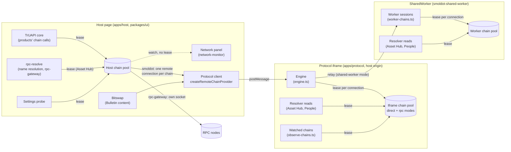
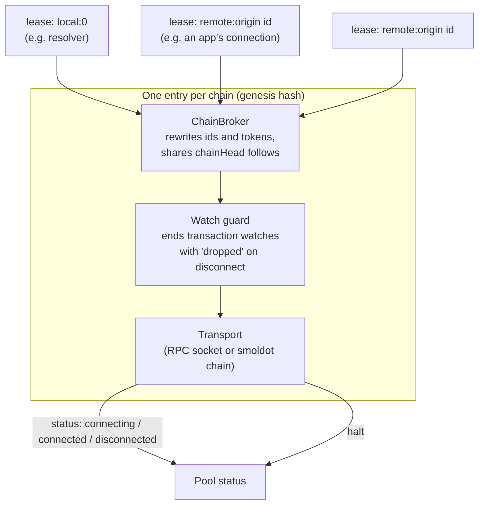
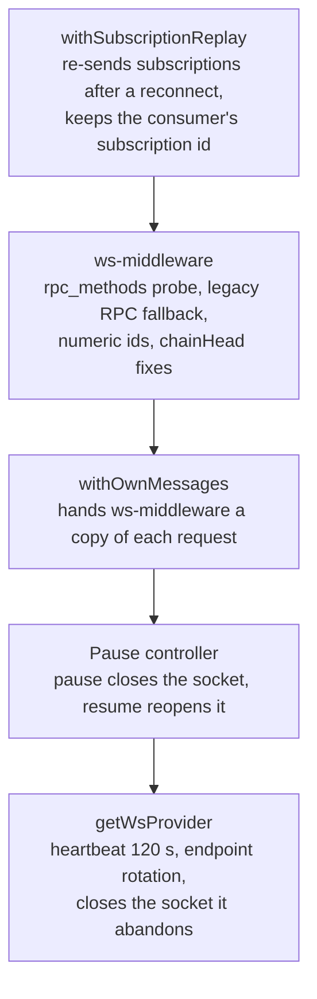
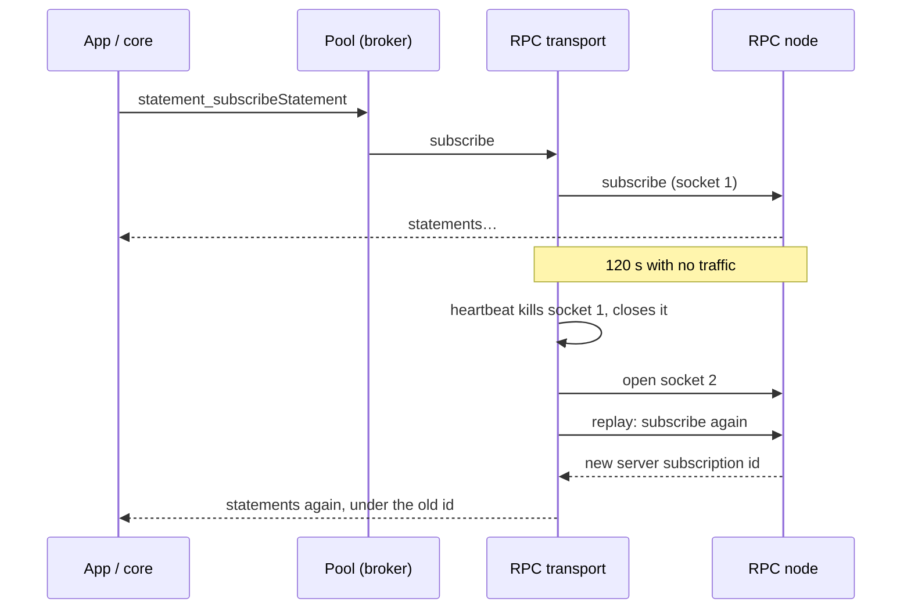
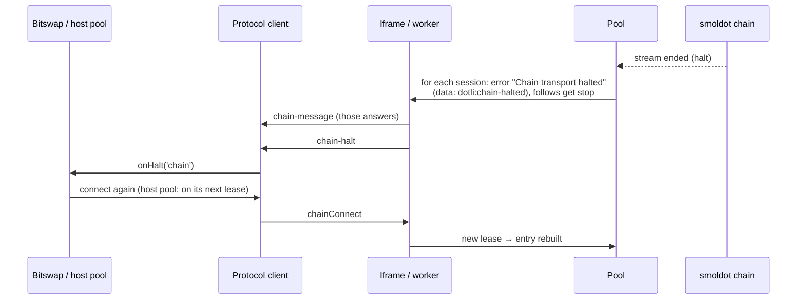
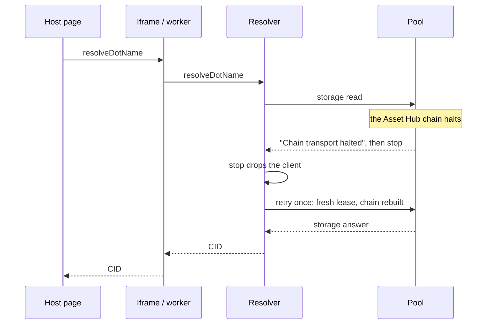
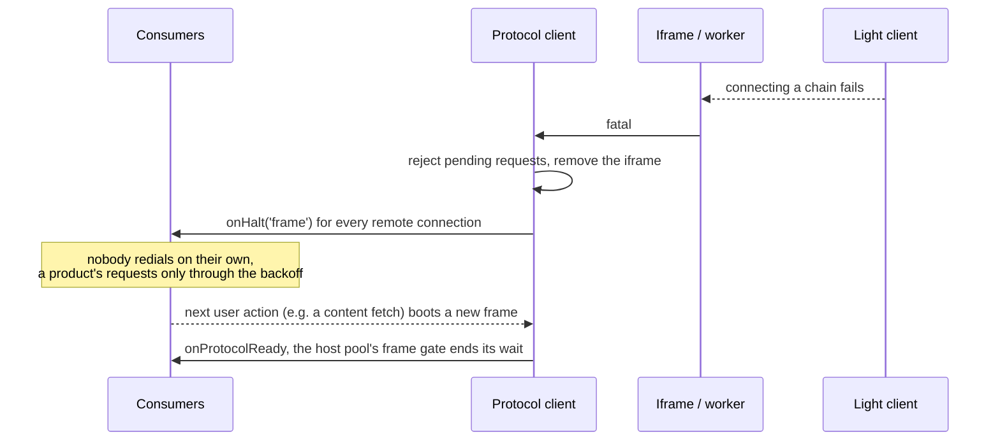

# Chain connections

How dot.li talks to chains: who opens connections, how they are shared, and
what happens when one breaks. This covers the work in #311 and #313 (issue
#308).

## The short version

- Every chain connection goes through a **chain pool**. A pool keeps **one
  connection per chain** and hands out **leases** on it. Whoever needs a chain
  takes a lease, and gives it back when done.
- There are three pools, one per place that talks to chains: the **host
  page**, the **protocol iframe**, and the **SharedWorker**.
- Every chain user on the host page leases from the **host pool**, except
  bitswap. The host page runs **no light client**: on the smoldot backends the
  host pool reaches each chain over one remote connection to the protocol
  iframe, whose light client serves it. On `rpc-gateway` the host page holds
  the only sockets: one per chain, in the host pool (bitswap aside, see
  Known limits).
- A pool closes a chain a while after its last lease is returned: 60 s in the
  host pool and for an RPC socket, never for a smoldot chain in the iframe or
  the SharedWorker (re-syncing a light-client chain is expensive).
- When a chain **halts** (dies for good), the pool first answers everything
  that was still waiting on it, then tells each lease holder. The next lease
  builds the chain again. Holders reconnect on their own (a product's
  requests through a backoff per chain), and a name resolution the halt cut
  off is retried once on the rebuilt chain.
- When the **light client itself** cannot work any more, that is a **fatal**.
  The host tears the protocol iframe down, every remote connection is told
  `'frame'`, and nothing redials by itself, except a product's own requests,
  which may boot a new frame at most once per backoff window (1 s, doubling
  to 30 s, back to 1 s only for a frame that stayed up more than 30 s).

## Where chains are used

In simple terms:

- **The host page** has its own pool. Products' chain calls (through the
  TrUAPI core), name resolution in `rpc-gateway` and the settings probe all
  lease from it, so the host page holds one connection per chain.
- **The network panel** leases nothing. `ChainPool.watch` reports each
  chain's leases, status, follow and best-block numbers, which the broker
  derives from one `chainHead_v1_header` per follow.
- **The host pool's transport follows the backend.** In `rpc-gateway` it is
  the host page's own RPC socket. On the smoldot backends it is one remote
  connection per chain to the **protocol iframe** over `postMessage`
  (`createFrameChainTransport`, through `createRemoteChainProvider`), which
  becomes one lease in the iframe's pool, next to the resolver's.
- **Bitswap** keeps its own remote connection to the iframe: `@dotli/content`
  cannot import the host pool. On the smoldot backends that lands on the same
  chain in the iframe's pool, so no chain is duplicated.
- **The protocol iframe** has a pool in `smoldot-direct` (light client in the
  iframe) and `rpc-gateway` (WebSockets). In `smoldot-shared-worker` it only
  relays to the **SharedWorker**, whose pool serves every tab.
- Each tab has a budget of 10 chain connections. In `smoldot-direct` that is
  the tab's own iframe (`MAX_CONNS`). In `smoldot-shared-worker` the worker
  counts `MAX_CHAIN_CONNECTIONS` per port, which is one tab's iframe and so
  one origin, with no worker-wide cap: its pool shares the chains between
  tabs.
  Through the host pool a tab holds at most one connection per chain, plus
  bitswap's.

Which transport a pool builds depends on the backend:

| Backend | Host pool | Protocol iframe | SharedWorker | Closed after last lease |
| --- | --- | --- | --- | --- |
| `rpc-gateway` | RPC socket | RPC socket (rpc mode) | not used | 60 s |
| `smoldot-direct` | remote connection to the iframe | smoldot (direct mode) | not used | host 60 s, iframe never |
| `smoldot-shared-worker` | remote connection to the iframe | relay only | smoldot | host 60 s, worker never |

Closing the host pool's remote connection is cheap: the iframe or the worker
keeps the smoldot chain.

## Inside a pool

- **Entry**: one per chain, built on the first lease. It holds the transport,
  a watch guard and a broker.
- **Broker** (`ChainBroker`): many sessions share one transport. It rewrites
  every request id and subscription token so sessions cannot see or answer
  each other's traffic, and shares one `chainHead_v1_follow` between them.
- **Lease**: a broker session. Local leases are named `local:N`; remote ones
  `remote:<origin> <connectionId>`, so ids from different sites never collide
  and one site cannot reach another's connection.
- **Refcount**: the pool counts leases. When the last one is returned, the
  destroy delay starts; a new lease cancels it.
- **Watch guard**: transaction watches cannot be safely replayed, so on a
  disconnect the guard ends each answered watch with `dropped`.
- **Watch** (`ChainPool.watch`): reports each chain's leases, status, follow
  and best blocks without a lease, so it never builds a chain or keeps one
  past its destroy delay. A new watcher first hears every chain held now.
- **Broker observer**: one per broker, installed by the pool only while the
  pool is watched. It numbers best blocks from one `chainHead_v1_header` for
  the newest finalized block of one follow, sent under a `broker-base:` id,
  plus each block's depth above it. The frame and SharedWorker pools are never
  watched, so they send nothing extra.

## The RPC transport

An RPC chain socket (`packages/resolver/src/rpc-chain.ts`) is a stack:

- The **heartbeat** treats a socket that says nothing for 120 s as dead and
  opens a new one. That used to lose every statement subscription (#308).
  Now the **replay** layer subscribes again on the new socket, under the id the
  consumer already has, and the old socket is closed.
- `getConnectedRpcEndpoint(genesisHash)` tells the diagnostics popover which
  node a chain's socket is on.

The smoldot transport (`createChainProvider` in
`packages/resolver/src/provider.ts`) is one chain on the light client, in the
protocol iframe or the SharedWorker only. It does not reconnect underneath its
users: when its stream ends, it halts.

The host pool's transport on the smoldot backends (`createFrameChainTransport`
in `packages/ui/src/host-callbacks/frame-transport.ts`) wraps one remote
connection. It reports `connecting`, then `connected` as soon as the
connection exists: the remote provider has no finer signal, and queues sends
until the iframe accepts the connection. When the remote connection halts, it
reports `disconnected`, then halts with a `ChainHaltError` that carries the
reason, `'chain'` or `'frame'`.

## What happens when…

### …an RPC socket goes quiet (the #308 case)

Nothing is halted: the lease stays, and the app keeps its subscription id. The
store sends its matching statements again after a resubscribe; consumers
dedupe them.

### …one smoldot chain dies (a halt)

- Everything that was waiting is answered first, so nothing hangs.
- `data: 'dotli:chain-halted'` lets a client tell "the chain halted, try again"
  from a real error. Bitswap retries such a request within the same content
  fetch.
- The network panel reads the chain as "not in use" after the halt, until its
  consumer leases it again.
- The resolver's papi clients drop themselves when their follow gets `stop`;
  their next read takes a fresh lease. A resolution running at that moment is
  retried once on it (see below).
- On the smoldot backends the host pool's remote connection hears
  `onHalt('chain')`, and the host pool halts that chain the same way. Each
  TrUAPI core connection delivers its answers and stays open; its next request
  takes a new lease, which rebuilds the chain (a papi client in the product
  re-follows on the `stop`, and lands there), through that chain's gate (see
  [the host pool's gates](#a-product-keeps-retrying-after-a-halt-the-host-pools-gates)).
  The settings probe client hears `'chain'` (`hostChainProvider` reads the
  reason with `haltReasonOf`).

### …a chain halts while a page is loading

- `withHaltRetry` in `packages/resolver/src/resolve.ts` wraps
  `resolveDotName`, `resolveExecutableManifest`, `resolveOwner` and
  `resolveRootManifest`. Both smoldot backends (`smoldot-direct`,
  `smoldot-shared-worker`) run them.
- A halt reaches a read in one of three shapes, and each one is retried:
  - the pool's answer to a request in flight, `Chain transport halted` with
    `data: 'dotli:chain-halted'`;
  - `ApiStoppedError` (`chainHead follow stopped`): the follow stopped before
    its first block;
  - papi's `DisjointError` (`ChainHead disjointed`): the same `stop` cut off an
    operation already running.
- The retry gets what is left of the request's sync budget, not a new one.
- **Once only.** If the retry halts too, the error reaches the host. Its error
  page shows the network-dropped copy: `chain-halted` for the first two
  shapes, which needs only a reload; the existing `chainhead-disjointed` for
  the third, which also purges the light client's caches.
- A light client that keeps dying does not loop: its next connect fails, and
  that is a fatal. Nor does a single chain that halts again each time it is
  rebuilt: products rebuild it only through its chain gate.
- `rpc-gateway` resolution needs no retry. Its RPC socket never halts: it
  reconnects and replays.

### …the light client cannot work (a fatal)

- A fatal is only raised when the light client **cannot connect a chain**. A
  crashed light client shows up that way: every chain halts, consumers
  reconnect, and the first reconnect fails.
- In the SharedWorker a fatal is **permanent** while any document holds the
  worker: tabs that connect later, and reloads, get the error at once instead
  of retrying a dead light client. It ends when the browser drops the worker,
  so closing every dot.li tab gets a new one. The error page says so:
  "Closing other dot.li tabs, then reloading."
- After `'frame'` the codebase never retries on its own: bitswap fails the
  fetch in progress. A product's requests are demand, but its papi client
  re-follows every 250 ms, so the host pool lets them boot a frame only
  through a backoff (below).
- The host pool's remote connections hear `'frame'` too. Each halts its chain
  with `ChainHaltError('frame')`. TrUAPI core connections deliver what was
  queued and stay open. A product's next request on one takes a new lease
  through the frame gate (below).
- A connection that never reaches a frame halts with `'frame'` too: the frame
  did not come up in time, its iframe failed to load, or it refused the
  `chainConnect` (for example at its connection limit). So bitswap drops that
  connection and dials again on the next fetch.
- A papi client re-follows on the `stop` that comes before `chain-halt`. The
  frame refuses that send, because it has already forgotten the connection.
  Such late failures, and those of sends still unacknowledged when a fatal
  arrives, are dropped quietly: the consumer has already heard `onHalt`.

### …a product keeps retrying after a halt (the host pool's gates)

A product's papi client re-follows every 250 ms, and after a halt each
re-follow is a new lease on the host pool. After `'frame'` that lease boots a
protocol frame. After `'chain'` it rebuilds the chain, which on the smoldot
backends adds it to the light client again and syncs it again. So a TrUAPI
core connection takes that lease only through a gate
(`packages/ui/src/host-callbacks/redial-gate.ts`), and the host pool has two
kinds:

- **the frame gate**, one per page, after `'frame'`;
- **a chain gate** per genesis hash, after `'chain'`.

Each gate is shared by every core connection it covers, so concurrent
connections dial once per window. Both work the same way:

- each dial through a gate shuts it again and doubles the delay, from 1 s up
  to 30 s;
- a halt with the gate shut keeps it shut; one that finds its window in the
  past (left there by a live frame's refusal long ago, say) arms it again from
  the halt;
- only uptime resets it: a halt more than 30 s after the last dial through
  the gate starts it over. Once the backoff has grown, dials come at most
  about once per 31 s, whatever the frame or the chain does;
- a re-lease that finds no transport keeps the connection behind the gate.

They differ in where they start, and in what lets a lease past them without
a dial:

| | Frame gate | Chain gate |
| --- | --- | --- |
| After the first halt, or a reset | waits 1 s | goes at once |
| A lease passes without dialing when | a frame is up (`isProtocolReady()`), or booting (`isProtocolBooting()`: started, not yet ready, and its ready wait has not timed out or failed): the lease waits on it | the chain is in the host pool again (another connection rebuilt it) |
| The wait also ends when | a frame reports ready (the delay stays) | never |

A frame reporting ready keeps the delay because in `smoldot-direct` a new
frame is ready before its light client has connected a chain, and may answer
for a while before it fails. Neither ready nor an answer proves it works, so a
light client that keeps failing keeps doubling.

A request a gate refuses, or one no lease can be taken for, is answered at once
with `Chain transport halted` (`data: 'dotli:chain-halted'`), so nothing hangs.

## Halt reasons at a glance

| Reason | Comes from | What it means | What consumers do |
| --- | --- | --- | --- |
| `'chain'` | `chain-halt` envelope | That chain died; the pool rebuilds it on the next lease | Reconnect (bitswap at once, a product's requests through the host pool's chain gate) |
| `'frame'` | `fatal` / `init-failed` envelope, or a `chainConnect` that never succeeded | The protocol iframe or light client is gone, or never came up for this connection | Don't redial on your own; wait for user demand or `onProtocolReady`. A product's requests are demand, rate-limited by the host pool's frame gate |

Through the host pool the reason travels as a `ChainHaltError`
(`packages/protocol/src/chain-halted.ts`), and `haltReasonOf` reads it back.
Any other transport halt, such as a socket's, reads as `'chain'`.

## Where to look in the code

| Piece | File |
| --- | --- |
| Pool | `packages/protocol/src/chain-pool.ts` |
| Broker | `packages/protocol/src/broker.ts` |
| Watch guard | `packages/protocol/src/watch-guard.ts` |
| Halted-chain marker, `ChainHaltError`, `haltReasonOf` | `packages/protocol/src/chain-halted.ts` |
| Protocol client (remote connections, halt reasons) | `packages/protocol/src/client.ts` |
| RPC transport | `packages/resolver/src/rpc-chain.ts`, `packages/resolver/src/pause-controller.ts` |
| smoldot transport | `packages/resolver/src/provider.ts` |
| rpc-gateway name resolution | `packages/resolver/src/rpc-resolve.ts` |
| smoldot name resolution, halt retry | `packages/resolver/src/resolve.ts` |
| Host error page classification | `apps/host/src/errors.ts` |
| Host pool, TrUAPI chain connections, `hostChainProvider` | `packages/ui/src/host-callbacks/Chain.ts` |
| Host pool's transport on the smoldot backends | `packages/ui/src/host-callbacks/frame-transport.ts` |
| Host pool's frame and chain gates | `packages/ui/src/host-callbacks/redial-gate.ts` |
| Settings probe | `packages/ui/src/settings-actions.ts` (`queryFinalizedBlock`) |
| Network panel | `packages/ui/src/network-monitor.ts`, `ChainPool.watch` in `packages/protocol/src/chain-pool.ts`, the broker observer in `packages/protocol/src/broker.ts`, `packages/protocol/src/header-number.ts` |
| Bitswap | `packages/content/src/bitswap.ts` |
| Protocol iframe engine | `apps/protocol/src/engine.ts` |
| Watched chains | `apps/protocol/src/observe-chains.ts` |
| SharedWorker sessions | `apps/protocol/src/worker-chains.ts`, `apps/protocol/src/protocol-shared-worker.ts` |

## Known limits

- `@parity/truapi-host` ignores the end of a chain connection's response
  stream, so the host never ends one on a halt: a core connection outlives its
  lease, and its next request takes a new one. Only `close()` ends it.
- The watched chains in `smoldot-direct` do not take a new lease after a halt;
  the loading bar loses that chain's progress until something else opens it.
- In `rpc-gateway`, bitswap (the product icon, the debug panel's archive) still
  asks the iframe's rpc mode for Bulletin, which opens a socket of its own.
- After a halt on the smoldot backends, a product's statement subscriptions
  and transaction broadcasts stop silently: the broker has no terminal event
  to send them, while the same connection keeps serving new requests on its
  new lease. The core does not know to subscribe again.
- A live frame that refuses every connection (for example at its connection
  limit) gets one `chainConnect` per product retry: the frame gate lets a
  lease through while a frame is up, so nothing backs those retries off.
- After a halt the network panel reads the chain as "not in use" until its
  consumer's next request leases it again.
- Storage can read "not in use" while bitswap fetches from Bulletin, since
  bitswap bypasses the host pool.
