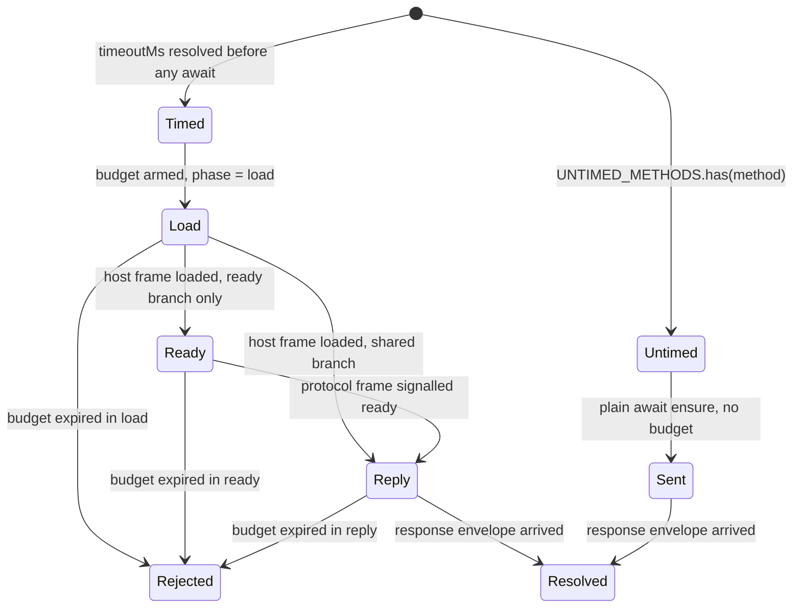
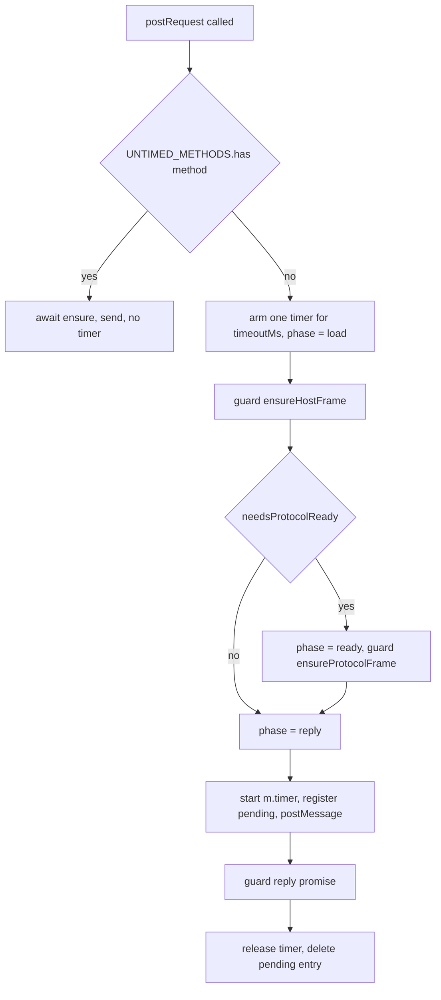

# Protocol Request Call-Time Budget - Plan

## Goal Capsule

- Objective: a protocol request rejects within its own per-method budget measured from the moment `postRequest` is called, including time spent waiting for the host or protocol frame, and the rejection names which phase consumed the budget.
- Authority: the Requirements below win on behavior. The Key Technical Decisions win on mechanism inside those Requirements. Origin issue: `paritytech/dotli-community#166`.
- Scope: `packages/protocol/src/client.ts`, `packages/protocol/src/errors.ts`, `packages/protocol/tests/client.test.ts`, and one doc comment in `packages/metrics/src/spans.ts`. No other package changes.
- Stop conditions: stop and report if the frame double described in U4 cannot drive `createHostIframe` without a real network navigation, or if any existing test in `packages/protocol` fails for a reason this plan did not predict.
- Tail: the caller owns commit, push, and PR.

---

## Product Contract

### Summary

Compute the per-method timeout before the frame wait and arm one timer at call time. Race that single timer against the frame wait and then against the reply wait. Reject with a typed error that carries the phase the budget was spent in: `load`, `ready`, or `reply`. Leave every existing timeout constant at its current value.

### Problem Frame

`postRequest` awaits `ensureProtocolFrame()` or `ensureHostFrame()` at `packages/protocol/src/client.ts:504` and only then computes `timeoutMs` (`:519-521`) and arms the reply timer (`:528`). The frame wait carries its own budget: `IFRAME_LOAD_TIMEOUT_MS = 30_000` (`:317`) and `IFRAME_READY_TIMEOUT_MS = 240_000` (`:321`). The rejection that finally arrives does not say whether the time went into booting the frame or waiting for a reply.

Worst case differs by branch, so the exposure is not uniform. A ready-branch request blocks for up to roughly 270 seconds (240 second ready wait plus its own budget) while its documented contract says 30. A shared-branch request awaits only `ensureHostFrame()`, so its worst case is roughly 60 seconds.

The blast radius is the boot path. `apps/host/src/main.ts:1324` resolves a name during boot on the ready branch, so it carries the 270 second exposure. `packages/ui/src/shared-mode.ts:97-99` reads shared-mode preferences and `packages/ui/src/host-callbacks/SessionStore.ts:124` reads the session, both on the shared branch at roughly 60 seconds. Each of the three is a first request.

### Requirements

**Bound**

- R1. A non-`warmup` request rejects no later than its own per-method budget, measured from the call, whether the budget is consumed by the frame wait or the reply wait.
- R2. `warmup` stays exempt from a request budget. Its rejection sources stay exactly what they are today: the frame wait, the reset error at `client.ts:168`, the unavailable-frame error at `:507`, and a `fatal` or `init-failed` envelope.
- R3. No existing timeout constant is reduced. `IFRAME_LOAD_TIMEOUT_MS`, `IFRAME_READY_TIMEOUT_MS`, `DEFAULT_TIMEOUT_MS`, and every `METHOD_TIMEOUTS` entry keep their current values.

**Attribution**

- R4. A budget rejection names the phase that consumed the budget. Three phases: host frame loading, protocol frame becoming ready, and waiting for a reply.
- R5. The phase is derived from observed progress, not from the `needsProtocolReady` flag. A request whose budget expires while the host frame is still loading reports the load phase even on the ready path.
- R6. A more specific error from the frame path wins over a budget rejection when it settles first. `ProtocolFatalError` (`packages/protocol/src/errors.ts:4`), `ProtocolInitFailedError` (`:11`), and the reset error at `client.ts:168` stay visible to callers.

**Coverage**

- R7. Both branches of `needsProtocolReady` are covered by a test that fails when the fix is reverted. The ready branch is covered by a frame that loads but never signals ready. The shared branch is covered by a frame whose load is deliberately late.
- R8. `bun run --cwd packages/protocol test` exits 0, and the 38 tests that pass today still pass.

### Key Decisions

- The three-phase vocabulary reuses the tokens already in the file. `client.ts:396` emits `phase: "load"` and `:465` emits `phase: "ready"` for `PROTOCOL_IFRAME_READY`. Governs R4, R5.
- The earlier-and-more-specific error wins rather than being wrapped in a timeout. Governs R6.

### Scope Boundaries

- In scope: the budget that `postRequest` owns.
- Not a goal: bounding the direct `ensureProtocolFrame()` calls at `apps/host/src/main.ts:990` and `client.ts:732`. Those are not requests and stay at 240 seconds.
- Not a goal: the unhandled rejection that `void ensureProtocolFrame()` and `void warmupProtocol()` at `apps/host/src/main.ts:990-991` already produce when the ready wait fails. Both stay untouched, for two different reasons: line 990 never enters `postRequest`, so no request budget could reach it, and line 991 is a `warmup` request that R2 keeps untimed.
- Not a goal: changing what `m.timer(S.PROTOCOL_REQUEST)` measures. See KTD5.

#### Deferred to Follow-Up Work

- Clearing `chainConnections` in `resetProtocolFrameState` so a `send()` after a reset fails fast instead of re-booting a frame. Surfaced while tracing `client.ts:787`, out of this issue's scope.

### Sources

- Defect anchors: `packages/protocol/src/client.ts:497-558` (`postRequest`), `:379-410` (`ensureHostFrame`), `:412-442` (`waitForProtocolReady`), `:444-479` (`ensureProtocolFrame`).
- Fast-fail precedent this plan preserves: `client.ts:156-173` (`resetProtocolFrameState`) and `:219-251` (the `fatal` and `init-failed` handler).
- Repo racing idiom: `packages/resolver/src/resolve.ts:212-220`, `packages/resolver/src/rpc-resolve.ts:93-102`, `packages/ui/src/topbar.ts:2099-2107`. There is no shared deadline helper and no `AbortSignal.timeout` anywhere in the repo.
- Method partition: `packages/protocol/src/auth-storage.ts:29-54`. Six methods take the shared branch (`authStorageRead`, `authStorageWrite`, `authStorageClear`, `modeStorageRead`, `modeStorageWrite`, `modeStorageClear`). The other eight take the ready branch.
- Metric attribute type is open (`packages/metrics/src/metrics.ts:45-57` ends in `& Record<string, string>`), so a `phase` key typechecks.
- No test and no consumer anywhere asserts on a `client.ts` timeout string, and every caller catches generically without inspecting type or message. Verified across `apps/host/src/main.ts`, `packages/ui/src/shared-mode.ts`, `packages/ui/src/topbar.ts`, `packages/ui/src/bulletin-bitswap.ts`, `packages/ui/src/host-callbacks/SessionStore.ts`.

---

## Planning Contract

### Key Technical Decisions

- KTD1. One timer armed at call time, raced against each phase. `startRequestBudget` arms a single `setTimeout(timeoutMs)` and exposes a `guard` that wraps a phase promise in `Promise.race`. Rejected alternative: deadline arithmetic with `Date.now()` and a second timer for the reply phase. That version depends on wall clock, so an NTP step or a laptop resume between phases silently moves the bound, and re-entering the timer queue adds the first timer's scheduling latency to the promised deadline. Advances R1.
- KTD2. `Promise.race` is the abandonment mechanism, with no manual `catch` on the loser. `Promise.race` attaches a handler to every operand, so a cached `hostFramePromise` or `protocolReadyPromise` that rejects after the budget won cannot become an unhandled rejection. A caller that abandons the wait and calls again rejoins the cached wait at `client.ts:451-452` while arming a fresh budget from its own call time, which is the semantics R1 asks for. Advances R1, R6.
- KTD3. Phase is a mutable variable read when the timer fires, and the ready branch is split into two guarded awaits. `postRequest` awaits `ensureHostFrame()` under phase `load`, flips to `ready`, awaits `ensureProtocolFrame()`, then flips to `reply`. The second call short-circuits at `client.ts:382` because `protocolIframe.contentWindow` is set by then. Rejected alternative: choosing the phase statically from `needsProtocolReady`, which mislabels a `chainConnect` budget (30_000 at `:490`) that expires during the 30_000 load wait as `ready`. Advances R4, R5.
- KTD4. A typed `ProtocolRequestTimeoutError` in `packages/protocol/src/errors.ts` carries `method`, `timeoutMs`, and `phase`. Tests assert on the `phase` field, not on message text. Rejected alternative: message-only attribution, which forces tests to match prose and gives callers nothing to branch on. Advances R4, R7.
- KTD5. `m.timer(S.PROTOCOL_REQUEST)` keeps starting at the reply transition, and `stopReq()` stays out of any shared `finally`. Frame boot is already measured twice by `PROTOCOL_IFRAME_READY` (`client.ts:394`, `:413`), so re-basing the request histogram would double-count boot into a per-request distribution and shift every dashboard percentile with no schema change to signal it. Sweeping `stopReq()` into a blanket `finally` would additionally start admitting failed requests into a histogram that today excludes them (`client.ts:547-552` deliberately omits it). Advances R3 by leaving telemetry semantics intact.
- KTD5b. `stopReq()` is called by `postRequest` around the reply guard, never by the budget timer callback. The callback is created before `stopReq` exists, so it cannot reach it. `postRequest` therefore awaits the reply guard in a `try`, calls `stopReq()` on success, and in the `catch` calls `stopReq()` only when the error is a `ProtocolRequestTimeoutError`, then rethrows. A `fatal`, `init-failed`, or response error still records no sample, matching `client.ts:547-552` today. Rejected alternative: passing a mutable stop-function holder into `startRequestBudget`, which puts metrics wiring inside a timing primitive to save nothing. Advances R3.
- KTD6. The budget is armed as the first statement inside the `try` whose `finally` releases it, and before the ensure promise is created. Arming first is what makes the 30_000-versus-30_000 collision deterministic: equal-expiry timers fire in creation order, so the budget beats `createHostIframe`'s load timer (`client.ts:349`). That ordering is load-bearing rather than incidental, because no method has a budget below `IFRAME_LOAD_TIMEOUT_MS`, so the tie is the only way a `load`-phase budget rejection is reachable at all. U4 asserts it directly and a comment in `postRequest` states the invariant.
- KTD7. The new test lives at `packages/protocol/tests/client.test.ts`. `CONTRIBUTING.md:5` asks for colocated unit tests, but `packages/protocol/vitest.config.ts:16` collects only `tests/**/*.test.ts`, so a colocated file would never run. The package's three existing tests are all named after their source file under `tests/`.
- KTD8. The test replaces the real iframe with a `document.createElement` seam rather than driving happy-dom. happy-dom's `HTMLIFrameElement` navigates on `connectedToDocument` and dispatches its own `error` event when the fetch to `http://host.localhost:*` is refused, which reaches `client.ts:361-365` and rejects the frame wait before any late manual `load` can land. A stub element also removes the `postMessage` target-origin check that `client.ts:556` would otherwise trip. `createHostIframe` only uses `src`, `setAttribute`, `tabIndex`, `style.cssText`, `addEventListener`, `appendChild`, `remove()`, and later `contentWindow`, so a plain element with a `contentWindow` property satisfies it. No production seam is added. Advances R7.
- KTD9. Tests use one static import plus `resetProtocolFrame()` in `afterEach`, not `vi.resetModules()`. The happy-dom environment is per file, so a reset module would append a second iframe and register a second `message` listener against the same shared `window` (`client.ts:66`, `:176-179`) while the first iframe stayed in `document.body`. `resetProtocolFrame()` already clears the iframe, both cached promises, and the ready flag, and rejects orphaned ready waiters (`client.ts:152-173`). Advances R7, R8.

### High-Level Technical Design

Phase progression and which timer owns each window:

The decision path inside `postRequest`:

### Assumptions

- A1. A stub element returned from a spied `document.createElement("iframe")` drives `createHostIframe` to resolution when the test dispatches a `load` event on it. U4 proves or disproves this on its first run. If it is false, the fallback is to stub `document.body.appendChild` as well, and the plan stops rather than adding a production seam.
- A2. Vitest fake timers cover `setTimeout` and fire equal-expiry timers in creation order. Load-bearing for KTD6 and asserted by U4's load-phase scenario.
- A3. The `phase` attribute on the timeout counter is not assertable in this suite, because `VITE_METRICS` is absent from `packages/protocol/vitest.config.ts:20-26` and `packages/metrics/src/metrics.ts:144` compiles metrics to no-ops without it. U3 is dashboard-only and carries no test.

### Intended Consequences Worth Recording

- The JSON-RPC error string on the provider path gains a phase clause. `buildJsonRpcError` (`client.ts:701-713`) renders `serializeError(error)`, which emits `message` only, so the code stays `-32603` and only the text grows.
- A `chainSend` issued after an in-page `resetProtocolFrame()` is now bounded by its own 30 second budget rather than up to 270 seconds. This does not hard-fail a legitimate cold presync, for two verified reasons. The reset paths that force `skipWorkerCache` (`apps/host/src/main.ts:845`, `packages/ui/src/topbar.ts:1570`) reload the page unconditionally (`main.ts:851`, `topbar.ts:1623`), so no live provider survives to send. The two in-page resets (`main.ts:808`, `shared-mode.ts:249`) leave `skipWorkerCache` off, and `client.ts:146-150` records that the SharedWorker keeps its presync progress across an iframe cycle, so the next ready signal is fast.
- A ready-branch request issued while a genuinely cold frame is still presyncing now rejects at its own budget. The boot resolve at `apps/host/src/main.ts:1324` is the real case, capped at 90 seconds. The cold boot itself keeps its full 240 second window, because it is driven by the direct `ensureProtocolFrame()` and the untimed `warmup` at `main.ts:990-991`, neither of which arms a budget. This is the bound the issue asks for, not an accident.
- A cold-frame `chainConnect` on the provider path still takes up to roughly 270 seconds, because `createRemoteChainProvider` awaits a direct `ensureProtocolFrame()` at `client.ts:732` before it posts the request. The request's own 30 second budget then covers only the reply. Bounding that direct wait is out of scope here.
- A request orphaned by a mid-flight `resetProtocolFrame()` now dies within the remainder of its call-time budget rather than a fresh per-method window. The JSDoc at `client.ts:139-143` states the old guarantee and is corrected in U2.

---

## Implementation Units

### U1. Typed timeout error with a phase field

- Goal: give the budget a rejection callers and tests can inspect structurally.
- Requirements: R4.
- Dependencies: none.
- Files: `packages/protocol/src/errors.ts`.
- Approach:
  1. Export `type ProtocolRequestTimeoutPhase = "load" | "ready" | "reply"`.
  2. Export `class ProtocolRequestTimeoutError extends Error` with `readonly method: string`, `readonly timeoutMs: number`, `readonly phase: ProtocolRequestTimeoutPhase`, and `name = "ProtocolRequestTimeoutError"`.
  3. Build the message inside the constructor so every call site is consistent: `Protocol request "<method>" timed out after <timeoutMs>ms while waiting for the host frame to load` for `load`, `... while waiting for the protocol frame to become ready` for `ready`, and `... while waiting for a reply` for `reply`.
- Patterns to follow: `ProtocolFatalError` and `ProtocolInitFailedError` in the same file set `this.name` in the constructor and add no other members. Single-sentence JSDoc per `CONTRIBUTING.md:59`. No em-dashes or semicolons in comments per `CONTRIBUTING.md:48`.
- Test scenarios: none. This unit is a constructor and a message table, refused as a test target because a type forbids the wrong phase and U4 asserts all three phase messages through the real budget.
- Verification: `bun run --cwd packages/protocol typecheck` passes.

### U2. Call-time budget in postRequest

- Goal: the per-method budget starts at the call and covers the frame wait.
- Requirements: R1, R2, R3, R4, R5, R6.
- Dependencies: U1.
- Files: `packages/protocol/src/client.ts`.
- Approach:
  1. Add `startRequestBudget(method, timeoutMs)` above `postRequest`. It arms one `setTimeout`, holds a mutable `phase` initialised to `"load"`, and returns `guard`, `enterPhase`, and `release`. `guard` is `Promise.race([work, expiry])`. The timer callback rejects with `ProtocolRequestTimeoutError` built from the phase held at fire time, and emits `m.count(S.PROTOCOL_REQUEST, { outcome: "timeout", method, phase })`.
  2. Move the `timeoutMs` computation from `:519-521` above the frame await. It is a pure function of `method`, so hoisting changes nothing else.
  3. Keep the untimed branch literal. When `timeoutMs` is `null`, arm no budget and take today's plain `await (needsProtocolReady ? ensureProtocolFrame() : ensureHostFrame())` path so `warmup` is behaviourally unchanged.
  4. Extract the envelope build, `pendingRequests` registration, and `postMessage` from `:510-557` into a helper that returns the reply promise and its request id. Delete the inner `setTimeout` at `:525-537`. The budget owns the timer now.
  5. In the timed path, arm the budget as the first statement inside a `try` whose `finally` calls `release()` and deletes the pending entry. Then guard `ensureHostFrame()`, and on the ready branch flip to `"ready"` and guard `ensureProtocolFrame()`. Flip to `"reply"`, start `stopReq`, send, and guard the reply promise.
  6. Keep the `frameWindow` check from `:505-508` between the frame phase and the send.
  7. Call `stopReq()` from `postRequest` around the reply guard per KTD5b, not from the budget callback: on success, and in a `catch` only when the error is a `ProtocolRequestTimeoutError`. Do not put it in the shared `finally`.
  8. Correct the JSDoc at `:139-143` to say an orphaned request rejects within the remainder of its call-time budget.
- Patterns to follow: the inline race idiom at `packages/resolver/src/resolve.ts:212-220`. The existing `phase` attribute spelling at `client.ts:396` and `:465`.
- Execution note: write U4's ready-branch test first and watch it fail against the current code, so the gatekeeper is proven to bite before the fix lands.
- Test scenarios: covered by U4.
- Verification: `bun run --cwd packages/protocol typecheck` passes, and every scenario in U4 passes.

### U3. Phase-aware telemetry doc comment

- Goal: the span doc stops describing a timeout attribute set that no longer matches the code.
- Requirements: documents R4's telemetry surface. The `phase` attribute that U2 adds to the `m.count(S.PROTOCOL_REQUEST)` timeout emission is this plan's own extension, not something the origin issue asked for, so this unit records it rather than implementing R4.
- Dependencies: U2.
- Files: `packages/metrics/src/spans.ts`.
- Approach: update the comment at `:142-147` to state that a timeout emits `{ outcome: "timeout", method, phase }`, and that the histogram covers the reply phase only while the counter covers the whole call-time budget.
- Patterns to follow: the sibling comment at `:135-140` documents `PROTOCOL_IFRAME_READY` attributes the same way.
- Test scenarios: none. Comment-only, and metrics compile to no-ops in this suite per A3.
- Verification: `bun run --cwd packages/metrics typecheck` passes.

### U4. Budget tests for both branches

- Goal: prove the bound and the attribution, and fail if the ordering defect returns.
- Requirements: R1, R2, R4, R5, R6, R7, R8.
- Dependencies: U1, U2.
- Files: `packages/protocol/tests/client.test.ts`.
- Approach:
  1. Static import of `@dotli/protocol/client`. `import { describe, expect, it, vi, afterEach, beforeEach } from "vitest"` because `globals` is `false`.
  2. `beforeEach`: `vi.useFakeTimers()`, then spy `document.createElement` so `"iframe"` returns a stub element carrying a `contentWindow` whose `postMessage` is a `vi.fn()`, and every other tag falls through to the real implementation.
  3. `afterEach`: `resetProtocolFrame()`, `vi.clearAllTimers()`, `vi.useRealTimers()`, `vi.restoreAllMocks()`, and empty `document.body`.
  4. Helper to dispatch `load` on the stub. Helper that reports whether a promise has settled without awaiting it, which must attach a rejection handler to the promise it inspects so a deliberately abandoned request cannot surface as an unhandled rejection when `afterEach` rejects it.
- Test scenarios:
  - As a caller of a ready-path method, I get a rejection within my own budget when the frame loads but never signals ready. Load the frame, call `resolveDotNameRemote`, assert still pending at fake 89_999ms, advance 1ms, assert rejection is a `ProtocolRequestTimeoutError` with `phase === "ready"`, `timeoutMs === 90_000`, and `method === "resolveDotName"`. This is the gatekeeper: reverted code stays pending until 240_000.
  - As a caller of a shared-auth method, I get a rejection within my own budget when the host frame loads late and no reply arrives. Call `readSharedAuthStorage`, dispatch `load` at fake 20_000ms, assert still pending at 29_999ms, advance 1ms, assert `phase === "reply"` and `timeoutMs === 30_000`. This is the shared-branch gatekeeper: reverted code arms its reply timer at 20_000 and stays pending until 50_000.
  - As a caller of a ready-path method whose host frame never loads, I get the frame-path error rather than a budget rejection, because it settles first. Call `resolveOwnerRemote` (90_000 budget), never dispatch `load`, advance past 30_000, and assert the rejection is `Shared host iframe timed out while loading` and not a `ProtocolRequestTimeoutError`, per R6. This holds only because the method budget exceeds the load timeout. The next scenario covers the case where they are equal.
  - As a caller of a 30_000-budget method whose host frame never loads, I get a load-phase budget rejection. Call `readSharedAuthStorage`, never dispatch `load`, advance to fake 30_000ms, and assert a `ProtocolRequestTimeoutError` with `phase === "load"`. The budget wins the equal-expiry tie against the load timer at `client.ts:349` because KTD6 arms it first. This is the only reachable path to `phase === "load"`, since no method has a budget below `IFRAME_LOAD_TIMEOUT_MS`.
  - As a caller whose frame is reset mid-wait, I see the reset error and not a budget rejection. Call `resolveDotNameRemote` on a loaded frame that never signals ready, call `resetProtocolFrame()` at fake 10_000ms, and assert the rejection is `Protocol frame state reset before ready signal` and not a `ProtocolRequestTimeoutError`, per R6.
  - As a caller of `warmup`, I am never rejected by a request budget. Call `warmupProtocol()` with a loaded frame and no ready signal, advance to fake 120_000ms, and assert still pending. The advance stays strictly below `IFRAME_READY_TIMEOUT_MS` so the ready wait does not reject and mask the claim.
  - As a caller on a healthy frame, my request resolves and nothing fires afterwards. Load the frame, dispatch a `ready` envelope, call `readSharedModeStorage`, capture the request id from the `postMessage` spy, dispatch a matching `response` envelope, assert it resolves with the payload, then advance past 30_000 and assert no unhandled rejection and no state change.
- Verification: `bun run --cwd packages/protocol test` exits 0 with all seven scenarios passing, and the first two fail when U2's budget arming is moved back below the frame await.

---

## Verification Contract
| Gate | Command | Applies to | Pass signal |
|---|---|---|---|
| Types | `bun run --cwd packages/protocol typecheck` | U1, U2, U4 | exit 0 |
| Types | `bun run --cwd packages/metrics typecheck` | U3 | exit 0 |
| Unit | `bun run --cwd packages/protocol test` | U2, U4 | exit 0, seven new scenarios pass, 38 pre-existing tests still pass |
| Revert probe | move U2's budget arming below the frame await, rerun the unit gate | R7 | the two gatekeeper scenarios fail |

This repo's package manager is bun (`package.json:33`, `packageManager: bun@1.3.6`), and pnpm refuses to run here. Do not substitute a `pnpm` command for any gate above.

Do not run the package's `lint` script. It is `bunx eslint src/` (`packages/protocol/package.json:12`), and `bunx` is a forbidden ephemeral package runner on this machine.

---

## Definition of Done

- R1 through R8 hold, with R8 read as the bun unit gate above.
- The revert probe in the Verification Contract has been run and the two gatekeeper scenarios were observed to fail against the reverted code.
- `IFRAME_LOAD_TIMEOUT_MS`, `IFRAME_READY_TIMEOUT_MS`, `DEFAULT_TIMEOUT_MS`, and `METHOD_TIMEOUTS` are byte-identical to `main`.
- The untimed `warmup` path arms no timer and creates no budget object.
- `stopReq()` appears only on the resolve path and the reply-phase timeout path.
- The JSDoc at `client.ts:139-143` and the comment at `spans.ts:142-147` match the shipped behavior.
- No abandoned experiment remains in the diff. No stub seam was added to `src/`.
