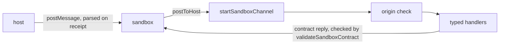

# `@dotli/sandbox-wire`

## Overview

The protocol between the host and a sandbox frame. It covers every message both ways, including the contract the host
delivers over an authenticated reply. It also holds the host's listener.

## Responsibilities

- **Owns:**
  - the contract message and its validator
  - the message shapes and parsers
  - the host's one channel for sandbox messages
- **Does not own:** what the messages drive, such as:
  - the block relay
  - the product frame
  - the loading screen

## Public API

### `@dotli/sandbox-wire`

- **Contract:** `SANDBOX_SCHEMA_VERSION`, `validateSandboxContract`, `SandboxParams`, `SandboxContractError` (has a
  `recoverable` flag).
- **Messages:** `parseHostToSandboxMessage`, `postToHost`, `HostToSandboxMessage`, `SandboxToHostMessage`,
  `BitswapResultMessage`, `SandboxNavigateMessage`, `SandboxContractRequestMessage`, `SandboxContractMessage`.
- **Violation report:** `parseApiViolationMessage`, `ApiViolationMessage`.
- **Load outcome:** `SandboxLoadOutcome`, `isLoadedOutcome`.
- **Channel:** `startSandboxChannel`, `StartedSandboxChannel`, `SandboxChannel` (without `stop`), `SandboxSender`,
  `SandboxMessageType`, `SandboxMessageOf`.

## Design

```mermaid
flowchart LR
  sandbox -- postToHost --> channel[startSandboxChannel] --> check[origin check] --> handlers[typed handlers]
  handlers -- "contract reply, checked by validateSandboxContract" --> sandbox
  host -- "postMessage, parsed on receipt" --> sandbox
```

- **Additive only:** host and sandbox may run different releases after a deploy. Add optional fields or new message
  types. Never rename or retype.
- **The contract carries every decision:** the sandbox cannot read the host's settings.
- **No defaults:** an unknown value throws. A missing required field is recoverable, so the host can render again.
- **Schema version:** a new required field bumps `SANDBOX_SCHEMA_VERSION`.
- **Parse on receipt:** any frame can post to a window, so each side drops what does not parse.
- **One host channel:** drops untrusted origins and isolates a throwing handler.
